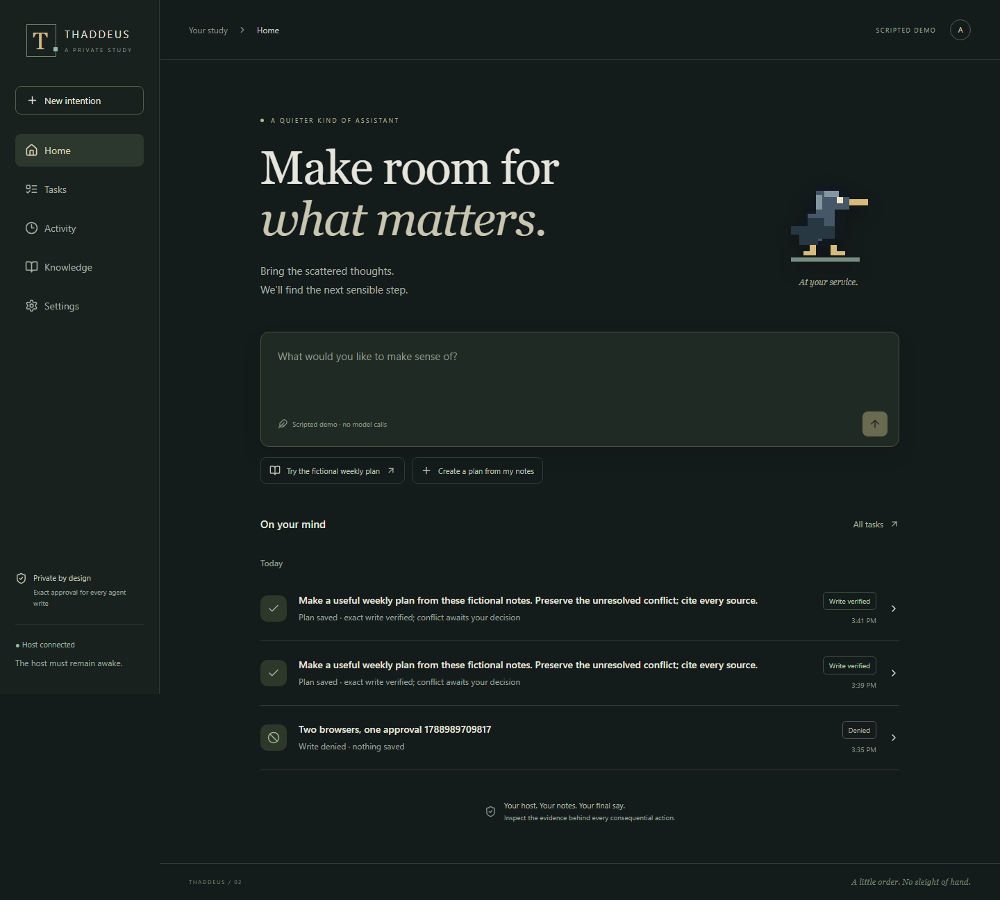

# Thaddeus 2.0

A private study for turning notes into an inspectable, approval-bound weekly plan.
ASP.NET Core 10, React/TypeScript, SQLite, and ordinary Markdown. Original temporary
pixel raven; no GPU, account key, or model download required for the scripted demo.



**Prototype, not production-ready or security-audited.** The default provider is
explicitly simulated. A successful write means the exact approved bytes were read
back and hashed, not that every claim in the plan is true.

## Launch

Prerequisites: .NET SDK 10.0.203 (compatible patch roll-forward), Node 22, npm.
From the repository root:

```powershell
./scripts/start.ps1
```

```sh
sh scripts/start.sh
```

Open http://localhost:5179. Read `.data/host-key.txt` locally and paste its contents
into the unlock form. This is a secret: do not share it or put it in a URL. Each
browser receives a revocable HttpOnly session. Nothing installs an always-on service.

Choose **Try the fictional weekly plan**, inspect the three selected source notes,
and start. The run pauses for one exact write approval. Approve or deny, open the
saved plan, edit it, and inspect its revision history. **Activity** reconstructs
run summaries from SQLite; each row opens source evidence and complete recorded
events. Close/reopen the browser without cancelling work. The host must remain
running and awake. On restart, unknown in-flight work requires reconciliation.

## Verification

```powershell
./scripts/doctor.ps1
./scripts/test.ps1
dotnet run --project evals/Thaddeus.Lab
# In another terminal while the demo host is running:
cd web
npx playwright install chromium
npm run test:e2e
```

Shell equivalents: `sh scripts/doctor.sh`, `sh scripts/test.sh`. Browser tests add
fictional test pages and runs; use a disposable demo workspace, not personal notes.
Results go to ignored `artifacts/`; screenshots are emulated browser captures.
The Lab command compares minimal/evidence policies and validation/journal-detail
ablations through the same Runtime, Store, tools, and permissions as the product.
It emits **INCONCLUSIVE** for efficacy: scripted contract cases cannot prove model
lift. The validation-removal negative control deliberately exposes a false success.

## Live models

In Settings select OpenAI-compatible, enter the exact model and base `/v1` URL,
save the destination, then test discovery. Credentials belong only in the host
environment: `Thaddeus__ApiKey`. HTTP endpoints must be loopback; hosted endpoints
require HTTPS. No silent fallback or automatic model loading. Discovery is not
proof of tool calling. The adapter expects streaming Chat Completions, native
function calls, `reasoning_effort`, and `max_completion_tokens`; incompatible
endpoints fail honestly. Glimmer is unconfigured, with no assumed model ID.

**Verified development smoke:** `gpt-5.6-luna`, high reasoning, via the user's
authenticated Codex CLI. Three independent smoke runs each reached approval and
exact-write success in one call; reported aggregate usage was 44,354 input / 2,234
output tokens. Cost unknown. No local model
was called. This is a transport/product smoke, not a paired live efficacy study.

Optional development bridge (not a deployed provider service):

```powershell
$env:THADDEUS_CODEX_EXE = '<absolute path to your installed codex executable>'
node scripts/luna-bridge.mjs
# Then configure compatible / gpt-5.6-luna / high / http://127.0.0.1:5181/v1
```

The bridge uses existing CLI auth, ignores user configuration, disables shell and
patch tools, rejects observed tool execution, and returns a structured draft. It
buffers final CLI output into SSE; it does not claim native token streaming. Its
180-second limit is enforced; the CLI output-token ceiling is **not certified**.
Do not treat a subprocess or read-only CLI mode as a hardened security sandbox.
`node scripts/live-smoke.mjs` explicitly starts a live call and approves its fictional
test write; it is never invoked by CI. A failed smoke does not authorize a model switch.

## Secure phone path

Default binding is loopback only. Opt-in requires a private-network hostname and a
certificate trusted by the phone. Configure `Thaddeus__PhoneOrigin` to your exact
`https://host:port` origin and standard ASP.NET Core Kestrel certificate settings:
`Kestrel__Certificates__Default__Path` and
`Kestrel__Certificates__Default__Password` in the host environment. Keep the
default local origin for host-side pairing confirmation. No forwarded headers are
trusted. This prototype uses direct Kestrel TLS; a terminating reverse-proxy recipe
is deferred rather than enabling arbitrary forwarded-header trust.

On the host, Settings → create one-time code. On the phone, visit the trusted
HTTPS origin → connect a phone → submit the code. Confirm that device on the host,
then finish pairing on the phone. Codes expire in five minutes, are single-use,
and sessions can be revoked immediately. The phone's localhost is **not** your
computer. Plain LAN HTTP is not the installable production route. No router
forwarding or public deployment is provided. **TLS deployment and physical-phone
testing remain unverified.** Use the browser's Install/Add to Home Screen command
where supported; actual installation has not been certified on iOS/Android.

## Privacy and limits

`.data/` contains the ledger, sessions, access key, knowledge, and revisions. It is
excluded from Git, stored under your OS account, and **not application-encrypted**.
Back it up as private data. Export/deletion are available in Settings; deletion
does not securely erase disk blocks or remove sessions/provider settings.
The service worker caches only the static app shell. APIs use no-store. Documents
are untrusted and raw HTML is not rendered. Only `notes/<slug>.md` and
`plans/<slug>.md` paths are accepted; linked directories/files are rejected.
Local OS administrators and malicious processes with the same filesystem access
are outside this prototype's threat boundary.

| Capability | Status |
|---|---|
| Responsive Home, Tasks, Activity, Knowledge, Settings; state-aware raven | Implemented |
| Real scripted weekly-plan loop; exact approve/deny; edit/revisions | Implemented |
| Durable goals/events, cursor SSE, two-browser decisions, inspection replay | Implemented |
| Single-host lock, per-run exclusion, stale approvals, recovery stop | Implemented |
| Call/tool/repair/time budgets and per-call output ceiling | Implemented; endpoint must honor output ceiling |
| Aggregate token/cost admission and provider capability certification | Partial; unknown usage/cost remains unknown |
| Hosted-compatible adapter; Luna High development smoke | Implemented / smoke verified |
| General conversation | Partial: persisted deterministic greeting/help only |
| Agent tool registry/MCP | Typed two-tool boundary; external MCP transport deferred |
| Activity for direct edits | Revisions retained; separate human-edit feed rows deferred |
| Phone pairing/auth/revocation and HTTPS configuration | Implemented path; physical device/TLS unverified |
| Lab comparison / ablations / negative cases | Scripted contract suite implemented; live efficacy deferred |
| Scheduling, subagents, services, general plugins, native apps | Deferred |

See [reuse decisions](docs/REUSE_LEDGER.md), [architecture and threat boundaries](docs/ARCHITECTURE.md),
[verification evidence](docs/VERIFICATION.md), and [next work](docs/BACKLOG.md).
Original project code has no selected open-source license. Dependency licenses
remain their respective owners'; see [third-party notices](docs/THIRD_PARTY.md).
