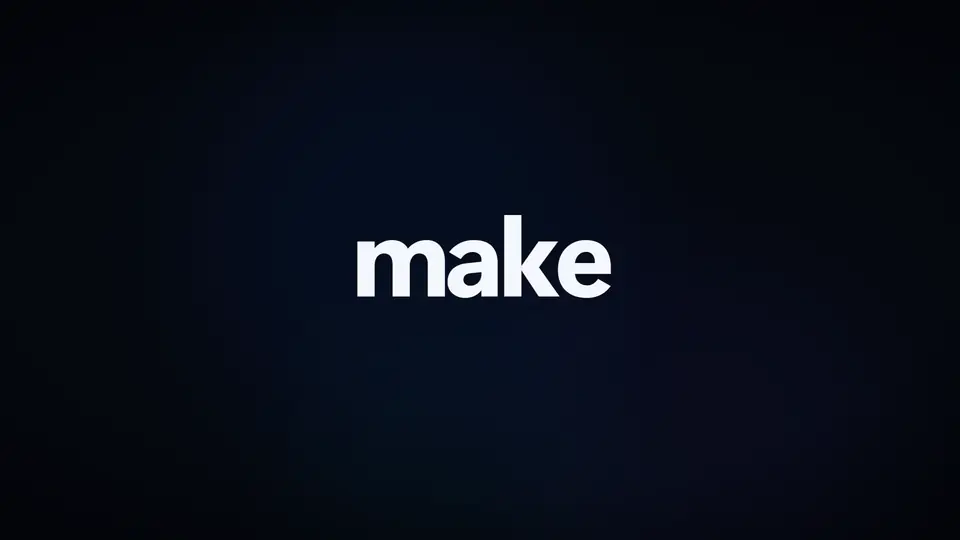
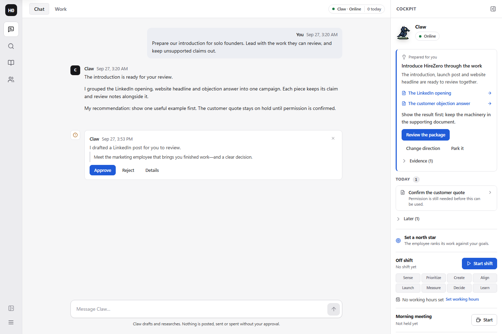
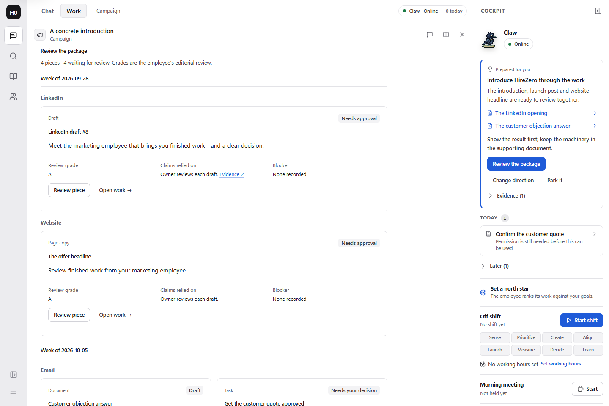
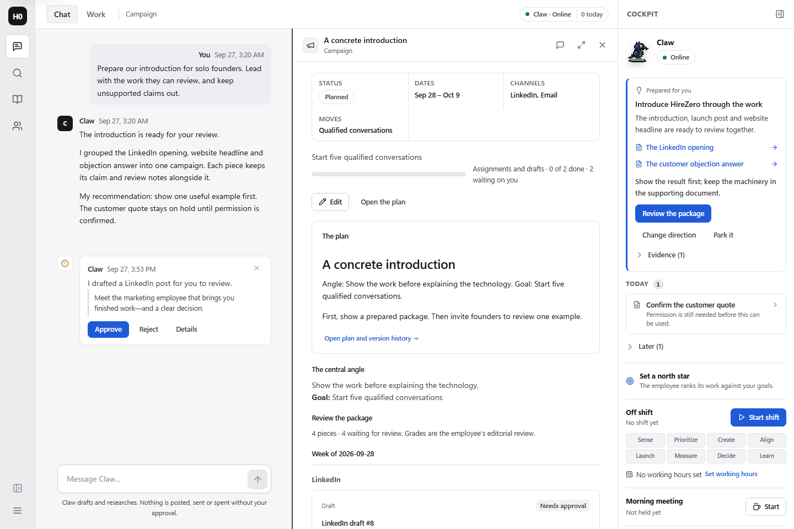
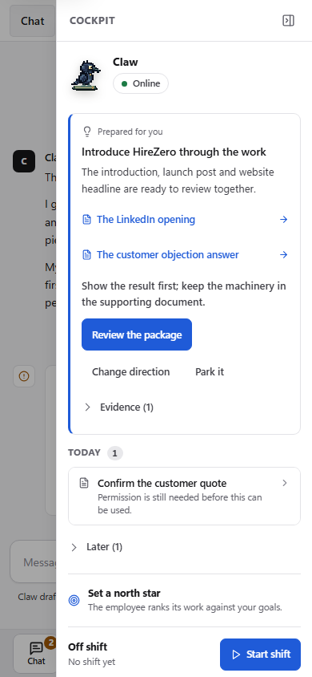
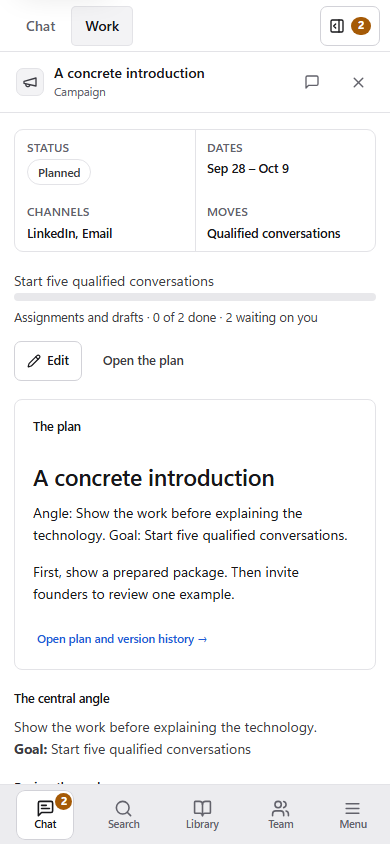

# HireZero · Marketing Lead

**A marketing employee that brings you prepared work and a clear decision.**

HireZero gives solo founders and small teams a place to work with Chip, an
OpenClaw marketing employee. Give it your business brief and an assignment. It
researches, prepares campaign pieces, reviews them against your direction, and
brings the work back to your cockpit.

You can inspect the sources, compare revisions, send work back, and decide what
ships. Your business brief, campaign plan, drafts and decisions stay together.

[How to install](docs/INSTALL.md) · [Your first assignment](docs/INSTALL.md#onboard-your-business)
· [Website](https://hirezero.app) · [Development](#development)

<a href="docs/media/hirezero/hirezero-promo.mp4"></a>

**[▶ Watch the 68-second promo, with sound](docs/media/hirezero/hirezero-promo.mp4)**

*A product promo made from real HireZero UI captures and motion recreations of
its screens, using sample workspace content. How it was made:
[docs/demo/promo](docs/demo/promo/README.md).*



*Current application UI, captured September 27, 2026 with fictional example
content. These screenshots illustrate the workflow; they are not customer
results or evidence of a live model run.*

## What working with Chip looks like

1. **Teach it your business.** Start from your website, a short interview or a
   written brief. Review what it learned, add your voice and examples, and set
   the goals and claims it should work within.
2. **Give it a job and start a shift.** Assign a concrete outcome and choose the
   available work limits. Follow its progress and open the artifacts it prepares.
3. **Review one recommendation.** The cockpit leads with prepared work, why it
   matters, the recommendation and its evidence. Review the package, change
   direction or park it. Smaller decisions sit under Today and Later.
4. **Review the campaign as a whole.** Its plan and central angle sit alongside
   pieces grouped by week and channel, with status, review grades, claims and
   blockers. Open each piece to approve it or send it back with a note.
5. **Choose what goes out.** Review the destination and action shown before
   confirming. Connected publishing, saving a CMS draft and copying into a
   network's composer have different effects.

## The campaign is the unit of work

A launch is more than a pile of posts. The campaign package connects the plan to
its documents, social drafts, page copy, media and tasks. Document history and
linked draft comparisons let you see what changed after your feedback.



*Example campaign in the current UI. Grades are the employee's editorial review,
not independent verification of a claim or a forecast of campaign performance.*

<details>
<summary>See the plan and phone layouts</summary>



<p>
  
  
</p>

These are responsive browser captures with fictional content. They do not
demonstrate SMS delivery or a hosted mobile installation.

</details>

## How to install

**Early preview:** start with the source installation below. A prebuilt public
image and one-click Agent Index installation are being finalized. The local
package has installation and restart checks; hosted access and outside-user
acceptance remain separate release steps.

The [installation guide](docs/INSTALL.md) covers prerequisites, building the
package, connecting your own Plow account and phone line, starting the cockpit,
onboarding, updates and troubleshooting. On Windows, use Docker Desktop with
Linux containers and WSL2 for the Bash/Plow setup.

If you are preparing the release, use the [release checklist](docs/PLOW_RELEASE_CHECKLIST.md)
and [submission kit](docs/HACKATHON_SUBMISSION.md). Installing privately does not
submit an agent to the competition.

## Approval and publishing

Chip prepares work for review. The application records decisions against the
draft revision being reviewed. A plain draft approval and a combined publishing
action are different controls:

- **Approve** records the review decision.
- **Approve and schedule** also schedules through the selected connection.
- A **save-as-draft** action leaves the item in the destination's draft workflow.
- A **copy/composer** action opens the external composer for you to finish.

Use the action's label, destination and time as the authority for what will
happen. Review evidence yourself; an employee-generated grade is not a fact check.

## Where the pieces run

| Piece | Job |
|---|---|
| React cockpit | Conversation, campaign review, work previews, decisions and settings |
| .NET host | Workspace APIs, permissions, approval and publishing workflows |
| OpenClaw employee | The marketing persona and model-backed work inside the Plow package |
| Marketing ledger and documents | Saved assignments, drafts, evidence and decisions |
| Plow | Agent identity, messaging and the configured model route |

The local package runs these services in Docker and stores its state in a named
volume mounted at `/var/lib/plow`. Your computer must remain running for that
local installation to work. The browser is the management interface; opening it
on another device does not create a second employee.

## Privacy, costs and current limits

- Business data persists in the installation's Docker volume. Keep that volume
  and the separate credentials file private and backed up. Local storage does
  not mean offline inference: requests use the configured model service.
- Account and agent credentials are supplied at installation time, not included
  in source or container images.
- Usage reporting to the Agent Index is off while `AGENT_ID` is empty. Enabling
  it reports this installation's usage through the inherited Index client.
- Model availability, quotas and charges depend on Plow/provider terms. No
  unlimited free allowance or verified hard monetary cap is promised.
- The public release still needs acceptance of a real campaign shift, phone
  continuity, native multiplayer and a fresh outside-user installation. Workspace
  roles alone do not prove OpenClaw multiplayer. See the
  [current release gates](docs/PLOW_RELEASE_CHECKLIST.md).

## Development

The current product lives on `main`. It builds on the Thaddeus host and the
marketing-hire ledger; historical Thaddeus handoffs describe that earlier product,
not the current HireZero installation.

Use the SDK pinned by `global.json`, Node 22 and the locked web dependencies.
Read [AGENTS.md](AGENTS.md) and [local checks](docs/LOCAL_CHECKS.md) first. Run the
smallest checks covering your change; hosted GitHub Actions are disabled.

```sh
npm --prefix web ci
npm --prefix web run build
```

For package builds and disposable checks, follow [the Plow package guide](docs/PLOW_PACKAGE.md).
Routine checks use scripted fixtures and make no live model calls. Keep compact
receipts and remove owned test resources after their processes exit.

Further reading: [employee operating model](docs/EMPLOYEE_OPERATING_MODEL.md),
[marketing integration](docs/MARKETING_CONTRACT.md),
[architecture](docs/ARCHITECTURE.md), and
[screenshot provenance](docs/media/hirezero/README.md).

## License and credits

Original HireZero/Thaddeus project code is [MIT licensed](LICENSE).
The marketing hire's own additions are covered by
[their MIT license](business/agent/hire/LICENSE). OpenClaw, the Plow base and
other dependencies retain their respective terms; see
[third-party notices](docs/THIRD_PARTY.md).

The Plow base is used through its documented
[variant-image distribution route](https://github.com/plow-pbc/plow-openclaw-agent#building-a-variant-image).
The project's MIT license does not relicense those upstream files. Preserve
their applicable notices when distributing a derived image.
