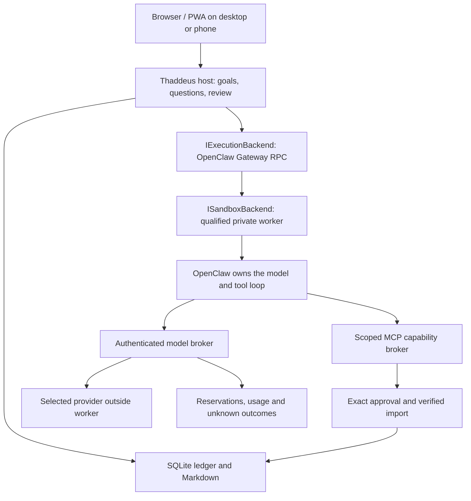

# Architecture and threat boundaries

## OpenClaw architecture in progress

The [implementation contract](IMPLEMENTATION_PLAN.md) is the active scope.
The diagram below shows ownership; worker admission is still disabled, and the
current UI continues to use the legacy conversation/plan path described below.

Docker Sandboxes 0.42.1 is the first adapter, with an OpenClaw 2026.9.4 image
pinned by digest. Creation requests no host workspace, denies network with the
recursive `**` rule, disables
shared skills and requests explicit CPU/RAM limits. Those arguments express
intent, not proof. The explicit Windows QEMU development adapter has demonstrated
brokered research, whole-worker restart and reviewed import/removal, but production
confinement remains unqualified. Production cannot fall back silently to a container
or host shell. The image's CPU-only Docker smoke is toolchain evidence.

The official MCP C# SDK serves stateless Streamable HTTP. A short-lived task
grant authenticates worker requests, distinct from browser sessions. Its scope
allows selected-note reads, durable questions and exact import proposals. Stable
operation IDs replay durable results without spending again or changing arguments.
Only the existing approval engine performs an original Markdown write.

The model broker accepts a bounded text/function subset of Chat Completions. It
fixes the destination/model/reasoning to the task snapshot, strips worker authority
and adds the host credential outside the worker. It requests buffered JSON and
can frame the completed result as SSE. Reservations and complete usage are
settled before proposals reach the worker. Missing usage consumes the reservation;
disconnects remain unknown and suspend further requests. Provider reports cannot
certify factual correctness, and a remote token ceiling remains uncertified.

An optional separate loopback `Thaddeus__WorkerPort` serves only worker routes;
ordinary UI/API traffic is refused there. Exact bearer scope, loopback connection,
Host, and forbidden browser/proxy headers are checked. The actual Sandboxes-to-host
network path still needs qualification. This listener is not a general LAN API.

Database schema 4 uses a transactional migration registry, additive JSON fields
and explicit memory/change tables. Old run/event bytes remain intact. Export
schema 4 retains existing collections and adds database-version metadata and
memory collections. A newer database version is
refused before schema writes. OpenClaw reports retain `worker-reported` authority;
native transcript correlation is separate from broker-verified host effects.

The context builder adapts v1's declarative personality mechanism. Registered profiles
keep the same persona and permission instructions. The evidence profile prefetches
only selected notes, charging each read and freezing exact source hashes. It
records whether the prepared text occurs in the actual model request; presence
does not prove the model used it correctly. The version-2 evidence profile adds
[explicit source-linked memory](SOURCE_LINKED_MEMORY.md) with correction, forgetting
and revocation checks outside the worker. Native delivery of selected context is
observed through the existing plugin hooks. No hidden retrieval or judge model is introduced.

New research uses the version-3 profile and [source quotation checks](NATIVE_EVIDENCE_REPAIR.md).
Typed citations resolve only to captured task evidence. Failed checks feed one
bounded correction back into OpenClaw, with no new host model loop or allowance.
Validator failure stops without approval. Exact proposal/review binding adds to
the mandatory import boundary; quotation provenance does not establish truth or
complete claim coverage. Earlier profile digests and contracts remain unchanged.

## Existing conversation and plan path

One ASP.NET host serves the compiled React app and authenticated APIs. Core owns
typed goals, outcomes, tool/model/policy contracts. Infrastructure implements
SQLite, Markdown, the runtime and model transports. Host composes them and owns
HTTP/device authorization. Lab depends on Infrastructure and invokes the same
runtime. Providers receive observations and return proposals; they cannot write
knowledge. The browser cannot execute tools or authorize itself.

The small tool surface is `knowledge.read` and `knowledge.write`, with typed JSON
requests/results compatible with a future MCP adapter. Only writes to `plans/`
are agent actions; direct user edits support `notes/` and `plans/`. No shell,
network-mutation, external plugin or background-observation tool exists.

Runtime reads explicitly scoped notes, reserves a model call, gets a typed proposal,
validates its structure, optionally repairs once, and persists an approval. Approval
is bound to run, ID, canonical typed action, `plans/` scope, target hash and expiry.
All source hashes are checked again. Denial terminates the run. Successful approval
records intent, writes, reads back the hash, and records the outcome. Factual
accuracy and conflict resolution stay human/unverified criteria.

SQLite commits run state and its next event together; conversation admission and
completion include the corresponding message in that same transaction. Context
is frozen at admission (last twenty messages), and only one conversation reply is
admitted at a time. Conversation has no knowledge scope or tool authority.

Content, revision and write-operation identity commit together before Markdown
projection. A crash leaves a durable committed operation. Restart marks running
work needs-attention and charges any unknown outstanding token reservation; it
never silently projects or retries. The reconciliation view binds its choice to
the inspected file hash: verify matching content, explicitly complete committed
content, or close without more writes. Changed sources, conflicting file content
and agent permission Off prevent stale execution. Reconciliation preserves one
revision and checks the exact hash. Export includes pending committed writes.

A file lease rejects a second host; per-run semaphores reject duplicate execution
and decisions, and version checks reject lost updates. Files and SQLite still
cannot share one atomic transaction; the committed-content protocol exposes and
reconciles that boundary. Malicious same-user filesystem races and exactly-once
external side effects remain outside scope.

Token admission precedes dispatch. Certified providers reserve their declared
input/output upper bound; uncertified providers reserve the full remaining
allowance. Reported usage settles the charge; missing usage retains the reservation.
Strict mode refuses uncertified bounds, including the Luna CLI bridge. A detected
provider overrun stops further action but cannot retroactively prevent remote use.
Cost remains unknown without a price source. SSE parsing bounds both line size and
total transport characters and rejects truncated responses.

Activity rows are deterministic projections of run state, not model-generated
history. Advanced disclosure retains canonical args, results, evidence, approval,
validation, retry, timing and usage records. SSE sends global cursors; reconnects
catch up from Last-Event-ID. Replay endpoints only read events. No hidden model
chain-of-thought is persisted. Provider failures do not log response bodies or keys.

Default network boundary: exact loopback origin, HttpOnly SameSite=Strict session,
per-session CSRF, Origin/Host/Sec-Fetch checks, no CORS, and no forwarded-header trust by default.
Pairing needs a one-time 40-bit code, a separate 192-bit claim cookie, a host owner
confirmation from loopback, then a single-use exchange. Requests are rate limited.
Device sessions are hashed at rest, expire after seven days, and are revalidated
for requests and live SSE. The host bootstrap key is plaintext under the OS account;
sessions/configuration are not advertised as encrypted.

Optional direct Kestrel HTTPS has an explicit allowed origin and trusted certificate.
Opt-in Tailscale Serve mode trusts one symmetric forwarded hop from exact IPv4/IPv6
loopback proxies and only the configured phone hostname. Owner bootstrap and host
confirmation also require the original local origin; proxy requests cannot acquire
owner authority. Funnel-marked requests are rejected. Real local TLS and proxy
boundaries are tested; live Tailscale deployment and physical mobile install remain
manual verification. No internet exposure is automated. Data exports include private notes
and receipts; user-initiated downloads must be handled as private files.

Raw Markdown HTML is not executed; unsafe URL protocols are removed by the renderer.
Path names use a strict allowlist and reject Windows ADS/traversal and reparse links.
The static shell alone is cached; API responses are no-store. Offline mutations
are disabled and never queued. Local administrators, filesystem races by hostile
same-user processes, hardware loss, backups, and secure erasure are outside scope.

The Luna bridge is an optional development process, not part of the deployed host.
It uses data-only structured CLI output, reports actual usage, checks for unexpected
tool execution, and never falls back to another model. Its final-output SSE framing
and uncertified CLI token ceiling are distinct from the compatible adapter's native
stream parser. This is not a hardened sandbox or a production authentication scheme.

Owner-managed collections (`library`) are independent of agent runs. Each edit
atomically writes the versioned item and a content-free change receipt. To-do
completion is an explicit user action, not a projection of a model's success
claim. Ideas and saved reading share this bounded store. Export schema 4 and
personal-data deletion include both items and their change receipts.
