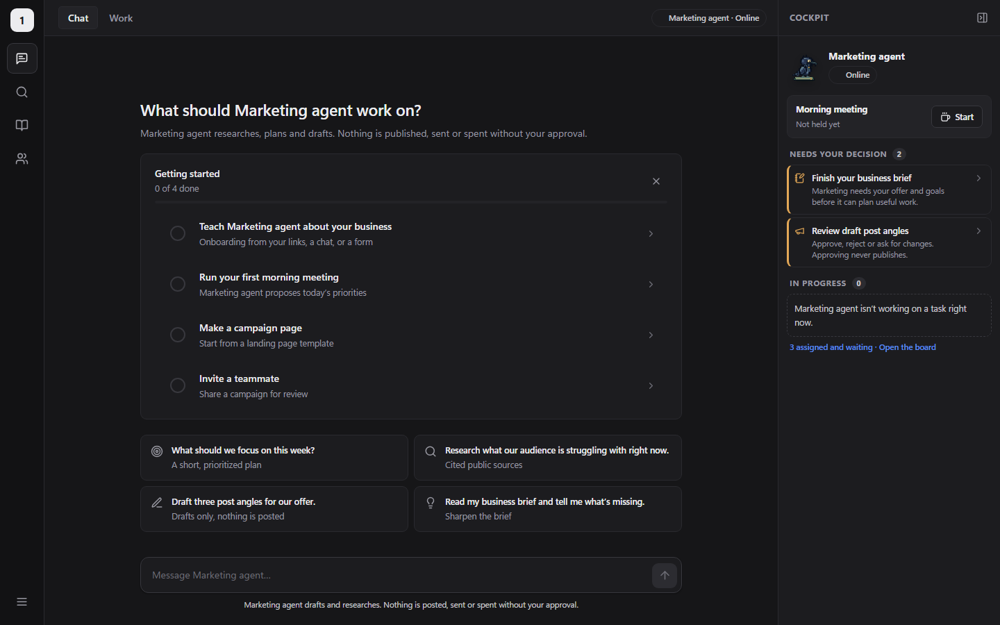
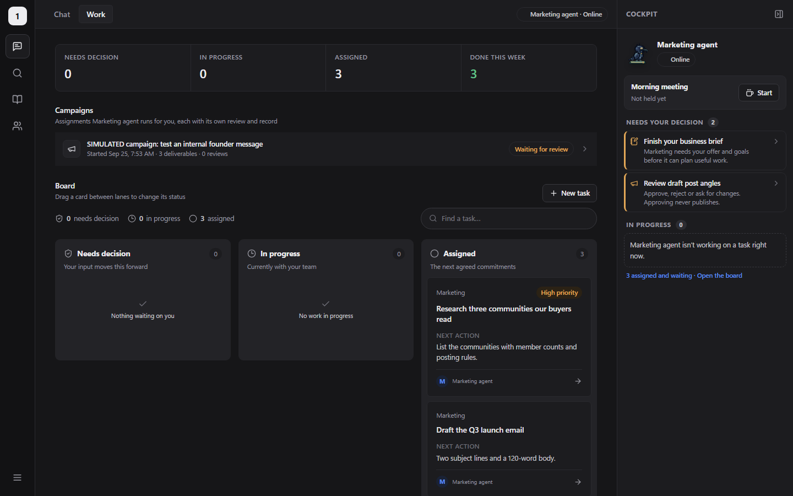
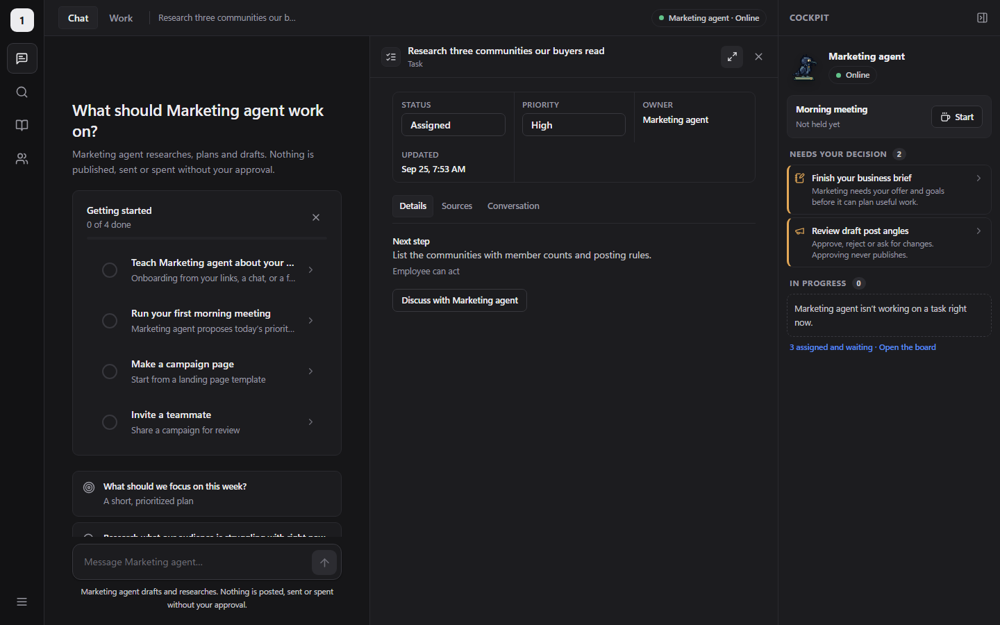
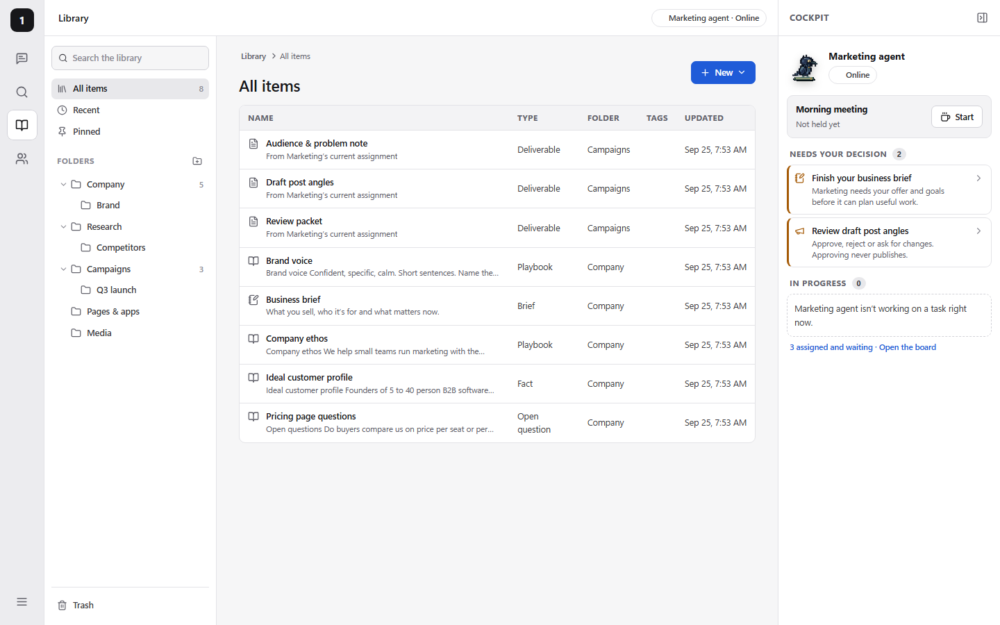
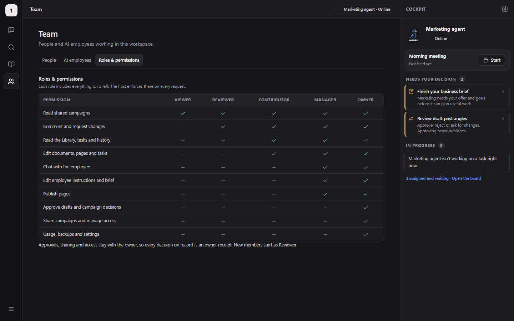
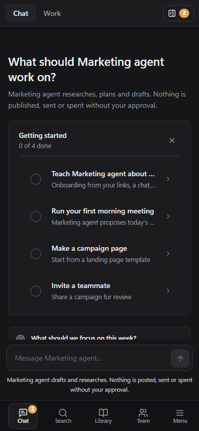

# Handoff — September 25, 2026

Branch `business/marketing-hire` (not `main`, which holds the original marketing-hire agent).

## Test it yourself

### 1. Free run on a disposable host (about 10 minutes, no model spend)

```bash
powershell -File scripts/start-campaign-fixture.ps1
```

This starts `http://localhost:5190` with a sample ledger and the scripted stand-in model. The host
key is in the `dataRoot` named in `artifacts/campaign-fixture-active.json`.

1. **Objectives:** in the cockpit, *Set a north star*. Add a key result, a proof point, one **Research site**, and a **Topic to watch** and a **Feed** under Listening.
2. **Scorecard:** Work → Scorecard → *Import data*. Paste a CSV with a date column and one or more metrics.
3. **Assign work:** Work → New task. Fill in **First step**: shifts only work tasks that have one.
4. **Shift:** cockpit → *Start shift* → 1 hour → *Run a cycle now*. Watch the stage strip; open what it made from the Shift log.
5. **Feedback:** on a document it wrote, choose *Useful* or *Not useful* and say why. On a draft, fill *Your reason*, then approve or reject it.
6. **Stop the shift.** Read the shift report (Library → Shift reports) and the **Marketing notebook** (Library → Company).

The words are placeholders here. Everything else is real: the loop, the records, the approvals and the filing.

### 2. Live, on your real workspace (spends model budget)

```bash
powershell -File scripts/start-marketing.ps1 -LiveShifts
```

This builds the app and stops the original dev `hire` container. It rebuilds and starts the product
employee container, then serves `http://localhost:5189`. Sign in with `.data/host-key.txt`.

1. **Data:** Work → Scorecard → *Connect data*. Google Analytics or Search Console signs in with your Google app; first enable the Analytics Data, Analytics Admin and Search Console APIs in its Google Cloud project. Plausible takes an API key.
1. **Objectives:** set or confirm the north star, objectives, positioning with proof points, competitors and non-goals. Add **Research sites**: your own site and competitors'. The employee reads nothing else except public discussions and headlines.
2. **Assign 2–3 real tasks** to the employee, each with a **First step**.
3. **Start a 1-hour shift.** Keep the suggested **token limit**: about 3,000 tokens a turn. Then *Run a cycle now*, or let it run on its own.
4. **Decide what it brings you,** with a reason each time. Reasons are what it learns from fastest.
4. **Publish:** connect a channel in Settings → Publishing channels (start with Bluesky or Mastodon; they take a minute). Open an approved draft from *Ready to post* and publish or schedule it.
5. **In chat, ask:** "What did you do on your last shift, and what do you need from me?" Chat now reads the same goals, shift record, verdicts and notebook as the shifts.

**What to note as you go:**
- anything confusing in the layout;
- work that is wrong, generic or unsupported;
- anything it should have asked first;
- tokens per shift against what you'd pay.

### Where things are

| What | Where |
|---|---|
| Live progress | Cockpit → Shift (stage strip), Work → Shift log |
| What it made | Library → Research / Campaigns → Drafts; drafts wait in the cockpit under *Needs your decision* |
| The write-up | Library → Shift reports; Library → Company → Marketing notebook |
| Spend | The Shift card (turns and tokens); each turn has a meter receipt in the employee's ledger |

## The layout (Muse structure, enterprise tone)

You asked for the Muse layout: Chat | Work in the middle, a managerial cockpit on the right, and on
the left chat, search, a wiki-style library, a multiplayer tab and Settings at the bottom. It should
feel dependable rather than flashy. One style replaces the old Clean/Muse switch:
- graphite neutrals and one blue accent;
- 1px lines, small radii and dense, calm type;
- precise status labels, with who and when on every record.

It comes in light and dark.

| Area | What it does |
|---|---|
| **Rail** | Chat · Search (Ctrl/⌘ K) · Library · Team. Pinned apps and documents sit below. A **Settings and account** menu is at the bottom left: Settings, Theme, Keyboard shortcuts, Sign out |
| **Chat \| Work** | Chat is the conversation: suggestions, the setup checklist, and each reply can be copied, saved to the Library or made a task. Work holds the stats (needs decision, in progress, assigned, done this week), the current campaign, the drag-and-drop board and recent activity |
| **Work window** | Anything you open appears beside the chat on wide screens, or full width: a task (status, priority, sources, its own conversation), the campaign review desk, a draft to approve, the brief, a document, page, media or source. Pin it or file it from the window header |
| **Cockpit** (right, pinned) | High priority only: employee status, the **morning meeting** (Start / Run again, last run), **Needs your decision** and **In progress**. It hides with one click, and on smaller screens it opens as a sheet from the top bar |
| **Library** | Wiki-style home for company details, research, campaign output, pages and apps, and media. **Nested folders** (create, rename, delete; built-in Company, Research, Campaigns, Pages & apps, Media). **Tags**. **Per-person pins**, which also appear in the rail. **Ranked search** that matches related terms (customer ↔ audience, brand ↔ voice). **New** → Document (8 playbook templates) · Page or app (templates, code editor, history, publish) · Upload · Folder |
| **Team** (multiplayer) | **People:** members table with a role per teammate, Revoke, Invite (pair a browser with a one-time code, or email a reviewer to a campaign), pending confirmations. **AI employees:** each one's instructions (AGENTS.md, HEARTBEAT.md…), permissions (PERMISSIONS.md) and business brief. **Roles & permissions:** the exact matrix the host enforces |
| **Settings** | Theme, desktop notifications, People and roles (→ Team), backup download, usage, account |
| **Roles** | Viewer → Reviewer (default) → Contributor → Manager → Owner. The rail and actions follow the role; the host checks every route. Approvals, sharing, access and backups stay with the owner |

What went away and where it lives now:
- **Today** → the cockpit (meeting, decisions) and the chat's empty state (checklist).
- **Inbox** → the cockpit.
- **Assets, Wiki, History** → the Library (plus Work → Recent activity).
- The old at-a-glance panel → the cockpit.

Host additions:
- The `workspace-library-v1` ledger (`/api/workspace-library`) stores folders, tags and pins. It is role-checked, versioned (409 on stale writes) and included in backups.
- The earlier additions remain: employee files, published pages with sandboxed `/p/<address>`, media inlining, member roles.
- Codex's review fixes landed in c4d27de:
  - teammates with a role no longer receive the owner's `/api/state`;
  - publishing requires the exact page version you reviewed.

The agent contract for Plow is in [EMPLOYEE_OPERATING_MODEL.md](EMPLOYEE_OPERATING_MODEL.md).

| Chat + cockpit | Work | Task beside chat |
|---|---|---|
|  |  |  |
| **Library** | **Team: roles & permissions** | **Phone** |
|  |  |  |

## Checks run

- **Browser, against a fresh fixture host, one spec per run:**
  - All 21 cockpit specs were migrated to the new shell, and the new `library.spec.ts` covers folders, tags, pins, related-term search, folder rename and delete, and contributor vs viewer access.
  - Each migrated spec passes on its own. These skip for want of their environment: `campaign-persistent-readonly`, `campaign-review-owner` (need the persistent pilot), `campaign-native-fixture`, and one test in `marketing-access-owner` (needs a private HTTPS origin).
  - `campaign-fixture-live` needs an unused campaign, so run it first on a new fixture.
- **Backend:** WorkspaceLibrary, MemberRoles, PublishedPages and EmployeeFiles: 14 passed.
- **Employee tooling, no model calls:**
  - `hire` ledger and campaign tests: 65 passed.
  - Request meter: 20 passed. Two files need the OpenClaw package that is only inside the image, so they can't load outside it.
  - OpenClaw configuration: 3 passed.
- **Known flake:** `campaign-shared-fixture` once got a host 409 when two linked-revision requests started Python at the same moment. It passed on rerun.
- **Old Thaddeus 2.0 specs** (feed, product, my-page and others) need the packaged host and are not part of this cockpit.
- **Shifts, research, review and feedback:**
  - backend suite: 1,282 passed, 1 opt-in network test skipped;
  - browser specs for the shell, library, roles, layout, objectives, shifts and campaign work passed on scripted fixtures.

## Where the employee stands

The employee now works **shifts**: a 1-to-24-hour loop of *sense → prioritize → create → align →
launch → measure → decide → learn*. See [EMPLOYEE_SHIFTS.md](EMPLOYEE_SHIFTS.md). The host runs
every stage and checks every model answer. The model holds no tools and never posts, sends or spends.

| Capability | State |
|---|---|
| Goals | North star, objectives, positioning, competitors, non-goals and research sites; every turn is ranked against them |
| Research | Recent Hacker News discussions read in full, `pulse` headlines, and pages on the owner's allowlisted sites, all cited |
| Listening | Watch topics (Hacker News, Google News, Bluesky) and followed feeds, hourly and in every shift, with no model cost. Spikes and negative turns become signals; Work → Listening shows the week |
| Quality | A critique turn on every deliverable (creative-review rubric) that revises weak work before you see it |
| Learning | Your verdicts and reasons, a Marketing notebook it keeps, and learnings in each shift report |
| One employee | Chat reads the same goals, shift record, verdicts and notebook as the shifts |
| Data | Google Analytics 4, Search Console and Plausible connections (read-only, synced every six hours and at each shift), plus CSV, file or public Google Sheet import. Flags material moves; measures experiments against pre-set rules |
| Launch | Approved drafts get a QA checklist (links, UTM tags, length, placeholders, risky claims). The owner publishes or schedules them to connected channels (Bluesky, Mastodon, WordPress, LinkedIn, X), or posts by hand |
| Spend | Model-turn budget and token limit per shift, both metered per turn. Live runs averaged about 2,800 tokens a turn |

**Live runs so far** (disposable hosts, your brief copied, draft objectives): four runs. The latest,
run 4, used 8 turns and 22,167 tokens and produced three pieces:
- a sourced positioning comparison against Jasper and Lindy;
- a 150-word hackathon description;
- a LinkedIn draft.

Its fixes are in (token limit, three site reads, no citation markers in posts). The receipt is at
`artifacts/receipts/live-shift-4-20260925.json`.

**Not yet, and not needed to test:**
- **Scheduling:** shifts are started by hand; there is no recurring schedule yet.
- **Metrics:** analytics connect (GA4, Search Console, Plausible); ads, revenue and CRM sources don't yet.
- **Reddit:** `pulse` rarely returns Reddit results without app credentials; see Listening in EMPLOYEE_SHIFTS.md.
- **Plow:** semantic search, one workspace per user and public page hosting all wait for Plow.

## Decisions for you

1. **Search depth:** Library search is ranked keyword search with stemming and a marketing synonym
   list, and it runs in the browser. True semantic search (embeddings) belongs with the agent in
   Plow. Until then, "Ask Marketing" in the search palette hands the question to the employee.
2. **Workspaces:** one per user, or a few members sharing one, needs Plow to run one isolated host
   plus agent per workspace. See "Many users" in the operating-model doc.
3. **Public pages:** this host refuses Tailscale Funnel traffic by design. Until Plow serves
   `/p/<address>` publicly, those links only reach people who can reach the workspace.
